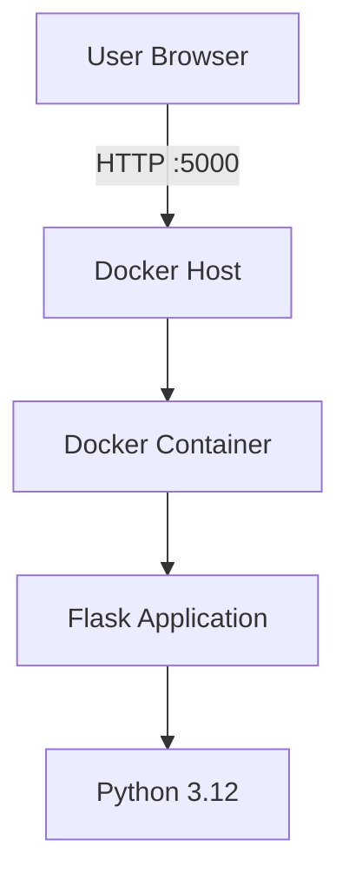
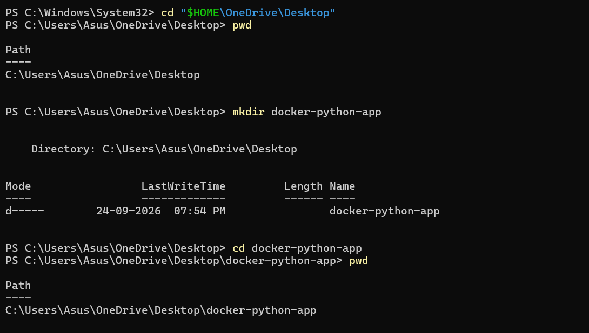
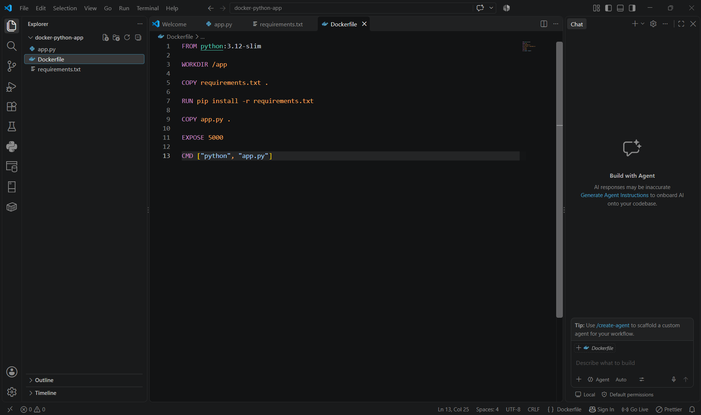
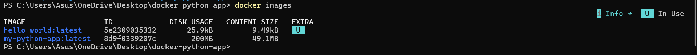

# Dockerized Python Flask Application

A simple Python Flask web application, containerized with Docker and run locally using Docker Desktop on Windows (PowerShell).

This repository documents a completed Cloud Computing / Docker laboratory experiment: installing and verifying Docker, writing a minimal Flask app, building a Docker image from a `Dockerfile`, running it as a container, and accessing it through a browser on `localhost:5000`.

---

## Overview

This project demonstrates how a basic Python Flask web application can be packaged into a Docker container and executed locally using Docker Desktop. The application itself is intentionally minimal — a single route that returns a plain text greeting — so that the focus stays on the containerization workflow: writing a `Dockerfile`, building an image, running a container, mapping ports, and verifying the result.

Everything in this repository reflects steps that were actually carried out during the experiment. No cloud deployment, orchestration, or CI/CD was performed — see [Future Scope](#future-scope) for what is intentionally out of scope.

## Objectives

- Verify the Docker installation.
- Run the Docker Hello World container to confirm Docker is working correctly.
- Create a simple Flask application.
- Define Python dependencies using `requirements.txt`.
- Create a `Dockerfile` for the application.
- Build a Docker image from the `Dockerfile`.
- Create and run a Docker container from that image.
- Map the container's port to the host machine.
- Access the Flask application through a web browser.
- Verify the running container using Docker commands.

## Technologies Used

| Technology | Purpose |
|---|---|
| Python | Application programming language |
| Flask | Web framework |
| Docker | Containerization |
| Docker Desktop | Local Docker environment (Windows) |
| PowerShell | Command-line interface |
| python:3.12-slim | Base Docker image |
| HTML/Browser | Application testing |

## Architecture

This is a **local** Docker deployment — the application runs entirely on the host machine inside a single container. No cloud provider, registry push, or external network is involved.



## Project Structure

```
dockerized-python-flask-app/
│
├── app.py
├── requirements.txt
├── Dockerfile
├── README.md
├── .gitignore
│
├── docs/
│   ├── screenshots/
│   │   ├── 01_Docker_Version_Verification.png
│   │   ├── 02_Docker_Hello_World_Test.png
│   │   ├── 03_Creating_Docker_Project_Directory.png
│   │   ├── 04_Flask_Application_app_py.png
│   │   ├── 05_Python_Requirements_File.png
│   │   ├── 06_Dockerfile_Creation.png
│   │   ├── 07_Verifying_Project_Files.png
│   │   ├── 08_Docker_Image_Build.png
│   │   ├── 09_Docker_Image_Verification.png
│   │   ├── 10_Docker_Container_Status.png
│   │   ├── 11_Docker_Container_Running.png
│   │   └── 12_Flask_Application_Browser_Output.png
│   │
│   └── LAB_REPORT.md
│
└── LICENSE
```

## Application Code

`app.py` defines a minimal Flask application with a single route (`/`) that returns a plain text message. The app is started directly with `app.run()`, binding to `0.0.0.0` so that it is reachable from outside the container, and to port `5000`.

```python
from flask import Flask

app = Flask(__name__)

@app.route("/")
def home():
    return "Hello! My first Docker application is running."

app.run(host="0.0.0.0", port=5000)
```

## requirements.txt

The only dependency required by the application is Flask itself, so `requirements.txt` contains a single line:

```
flask
```

This file is copied into the image and installed with `pip` before the application code, so that Docker's build cache can reuse the dependency layer if `app.py` changes but `requirements.txt` does not.

## Dockerfile Explanation

```dockerfile
FROM python:3.12-slim

WORKDIR /app

COPY requirements.txt .

RUN pip install -r requirements.txt

COPY app.py .

EXPOSE 5000

CMD ["python", "app.py"]
```

| Instruction | Purpose |
|---|---|
| `FROM` | Selects `python:3.12-slim` as the base image |
| `WORKDIR` | Sets `/app` as the working directory inside the container |
| `COPY` | Copies project files (`requirements.txt`, then `app.py`) into the image |
| `RUN` | Installs Flask via `pip install -r requirements.txt` |
| `EXPOSE` | Documents that the application listens on port 5000 |
| `CMD` | Starts the Flask application with `python app.py` when the container runs |

## How to Run

These are the exact steps used during the experiment (Windows, PowerShell, Docker Desktop).

**1. Verify Docker is installed:**

```powershell
docker --version
```

**2. Confirm Docker is working correctly:**

```powershell
docker run hello-world
```

**3. Navigate to the project location and create the project folder:**

```powershell
cd "$HOME\OneDrive\Desktop"
mkdir docker-python-app
cd docker-python-app
```

Create `app.py`, `requirements.txt`, and `Dockerfile` inside this folder with the contents shown above.

**4. Build the Docker image:**

```powershell
docker build -t my-python-app .
```

**5. Confirm the image was created:**

```powershell
docker images
```

**6. Run the container:**

```powershell
docker run -d -p 5000:5000 --name my-python-container my-python-app
```

**7. Confirm the container is running:**

```powershell
docker ps
```

**8. Open the application in a browser:**

```
http://localhost:5000
```

The page displays:

```
Hello! My first Docker application is running.
```

## Existing Container Name Issue

While re-running the container after it had already been created once, Docker reported that the container name `my-python-container` was already in use. This is not a failure — it simply means a container with that name already exists from a previous run.

The existing containers were listed first:

```powershell
docker ps -a
```

Since a container named `my-python-container` already existed, instead of creating a duplicate, the existing container was started directly:

```powershell
docker start my-python-container
```

The running container was then confirmed:

```powershell
docker ps
```

There is no need to delete an existing container just to make the name available again — `docker start` is the correct way to bring an already-created container back up.

## Verification

Three commands were used throughout the experiment to confirm each stage of the setup:

- `docker images` — confirms that the `my-python-app` image was built successfully and lists its size and image ID.
- `docker ps` — lists currently running containers, used to confirm `my-python-container` was up and its port mapping (`0.0.0.0:5000->5000/tcp`) was correct.
- `docker ps -a` — lists all containers, including stopped ones, used to check for the existing `my-python-container` before starting it.

## Application Output

Once the container was running and the port was mapped correctly, opening `http://localhost:5000` in a browser displayed:

```
Hello! My first Docker application is running.
```


## Screenshots / Experiment Evidence

| No. | Screenshot | Description |
|---|---|---|
| 1 | Docker Version Verification | Confirms Docker is installed and shows the installed version |
| 2 | Docker Hello World Test | Confirms the Docker installation works correctly |
| 3 | Creating Docker Project Directory | Creates and enters the `docker-python-app` project folder |
| 4 | Flask Application | Shows the contents of `app.py` |
| 5 | Requirements File | Shows the Flask dependency in `requirements.txt` |
| 6 | Dockerfile | Shows the container build configuration |
| 7 | Project Files | Lists the project files before building the image |
| 8 | Docker Image Build | Shows the `docker build` process completing successfully |
| 9 | Docker Image Verification | Lists the built `my-python-app` image |
| 10 | Container Status | Shows the existing container being started with `docker start` |
| 11 | Container Running | Shows the running container with its port mapping |
| 12 | Browser Output | Shows the Flask application response in the browser |











## What I Learned

- **Docker images** are read-only templates that package an application together with everything it needs to run (interpreter, libraries, code). A container is a running instance of an image.
- **Containers** are isolated, lightweight processes started from an image. Multiple containers can be created from the same image, and stopping a container does not delete it — it can be started again later.
- **Dockerfiles** are simple, declarative build scripts. Each instruction (`FROM`, `WORKDIR`, `COPY`, `RUN`, `EXPOSE`, `CMD`) adds a layer to the resulting image, and Docker caches layers that haven't changed, which is why `requirements.txt` is copied and installed before the rest of the code.
- **Port mapping** (`-p 5000:5000`) connects a port on the host machine to a port inside the container. Without this flag, the Flask app would only be reachable from inside the container, not from the host's browser.
- **The container lifecycle** goes beyond just "run once": a container can be created, stopped, started again (`docker start`), and eventually removed. `docker ps` shows running containers, while `docker ps -a` shows all containers regardless of state.
- **Running Flask inside a container** is not fundamentally different from running it locally — the difference is that the container provides an isolated, reproducible environment with its own filesystem and Python installation.
- **Image vs. container**: the image is the static, shareable artifact (built once with `docker build`); the container is the running process created from that image (`docker run`). The same image can produce many containers.
- **Why `0.0.0.0`**: binding Flask to `0.0.0.0` instead of `127.0.0.1` makes it listen on all network interfaces inside the container, which is required for the host to be able to reach it through the mapped port.
- **Why port 5000 is mapped**: Flask's development server listens on port 5000 by default, so the container's internal port 5000 is mapped to the host's port 5000 to make the app accessible at `http://localhost:5000`.
- **Environment isolation**: Docker packages the exact Python version and dependencies needed for the app, so it runs the same way regardless of what is or isn't installed on the host machine.

## Troubleshooting

**1. Desktop path issue**

`C:\Users\Asus\Desktop` did not exist as a plain path because the Desktop folder was located under OneDrive instead. This was resolved by navigating using the OneDrive path:

```powershell
cd "$HOME\OneDrive\Desktop"
```

**2. Container name conflict**

Running `docker run --name my-python-container ...` after the container had already been created once failed because a container with that name already existed. This was resolved by starting the existing container instead of creating a new one:

```powershell
docker ps -a
docker start my-python-container
docker ps
```

## Conclusion

The Flask application was successfully containerized using Docker. A `Dockerfile` was written to define the build process, a Docker image (`my-python-app`) was built from it, and a container (`my-python-container`) was created and run from that image. Port 5000 inside the container was mapped to port 5000 on the host, and the application was successfully accessed through `http://localhost:5000` in a browser, confirming that the containerized Flask app was working as expected.

## Future Scope

The following are **not implemented** in this repository and are listed only as possible future extensions:

- Docker Compose for multi-container orchestration
- Publishing the image to Docker Hub
- CI/CD pipeline integration
- Kubernetes deployment
- Cloud deployment (AWS/Azure/GCP)
- Container health checks
- Running behind a production WSGI server (e.g. Gunicorn) instead of Flask's development server

---

## License

This project is licensed under the terms described in [LICENSE](LICENSE).
