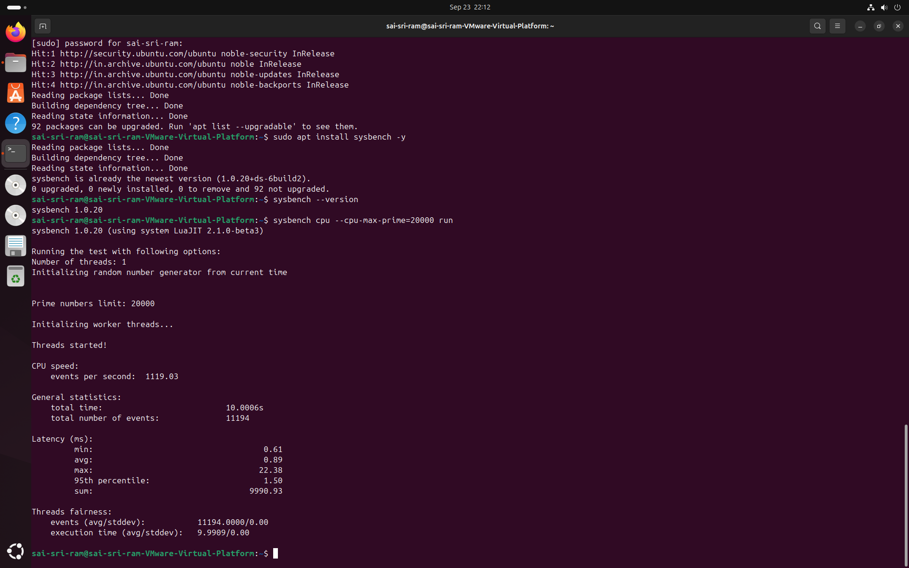
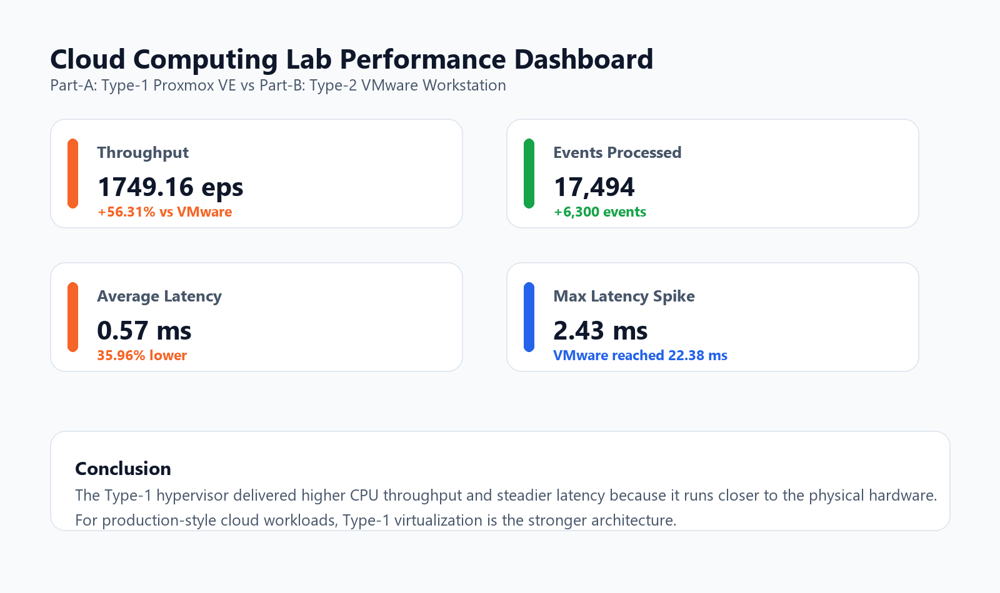
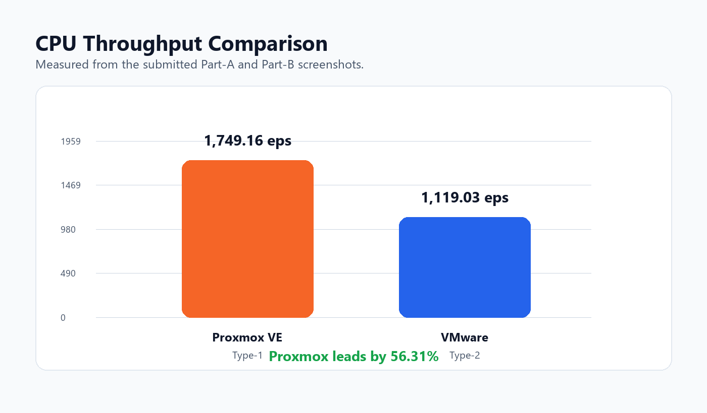
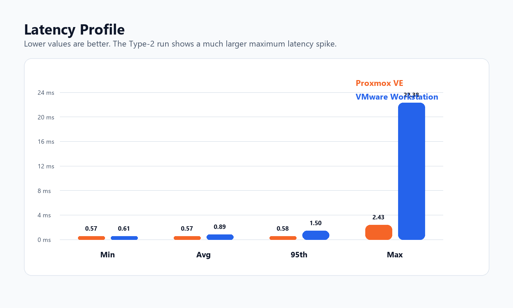

# Cloud Computing Lab Report

## Title

Performance Analysis of Type-1 and Type-2 Hypervisors

## Aim

To compare the CPU performance of a Type-1 hypervisor and a Type-2 hypervisor using Ubuntu virtual machines and the `sysbench` CPU benchmark.

## Hypervisors Used

| Part | Hypervisor | Type | Description |
| --- | --- | --- | --- |
| Part-A | Proxmox VE | Type-1 | Bare-metal hypervisor running directly on physical hardware |
| Part-B | VMware Workstation | Type-2 | Hosted hypervisor running above a host operating system |

## Tools and Commands

```bash
sudo apt update
sudo apt install sysbench -y
sysbench --version
sysbench cpu --cpu-max-prime=20000 run
```

## System Verification Commands

```bash
hostnamectl
lscpu
free -h
df -h
top
```

## Observations

| Metric | Proxmox VE Type-1 | VMware Workstation Type-2 |
| --- | ---: | ---: |
| CPU speed | 1749.16 events/sec | 1119.03 events/sec |
| Total time | 10.0005 sec | 10.0006 sec |
| Total events | 17,494 | 11,194 |
| Minimum latency | 0.57 ms | 0.61 ms |
| Average latency | 0.57 ms | 0.89 ms |
| Maximum latency | 2.43 ms | 22.38 ms |
| 95th percentile latency | 0.58 ms | 1.50 ms |

## Result Analysis

The Proxmox VE Type-1 hypervisor achieved higher CPU throughput than VMware Workstation. Proxmox completed 17,494 events in approximately 10 seconds, while VMware completed 11,194 events in the same time window.

The Type-1 hypervisor also showed better latency behavior. Its average latency was 0.57 ms compared with 0.89 ms on VMware Workstation. The maximum latency difference was especially large: Proxmox reached 2.43 ms, while VMware reached 22.38 ms.

## Screenshots

### Part-A: Proxmox VE


### Part-B: VMware Workstation



## Charts







## Conclusion

From the benchmark results, Proxmox VE Type-1 hypervisor provides better CPU performance and more stable latency than VMware Workstation Type-2 hypervisor. This confirms that Type-1 hypervisors are more suitable for production cloud environments, while Type-2 hypervisors are more convenient for personal learning, local testing, and development labs.

