# Cloud Computing Lab


## Performance Analysis of Type-1 and Type-2 Hypervisors

This repository presents a complete Cloud Computing laboratory experiment comparing the CPU performance of a **Type-1 bare-metal hypervisor** and a **Type-2 hosted hypervisor** using identical Ubuntu virtual-machine workloads.

The experiment is divided into two practical parts:

- **Part-A:** Proxmox VE Type-1 Hypervisor
- **Part-B:** VMware Workstation Type-2 Hypervisor


## Executive Summary

Both virtual machines were configured with Ubuntu and tested using the same CPU benchmark command:

```bash
sysbench cpu --cpu-max-prime=20000 run
```

The benchmark shows that **Proxmox VE Type-1 virtualization produced higher CPU throughput and lower latency** than VMware Workstation Type-2 virtualization in this lab setup.

> **Key result:** Proxmox VE reached **1749.16 events/sec**, while VMware Workstation reached **1119.03 events/sec**. That is a **56.31% throughput advantage** for the Type-1 hypervisor.

## Table of Contents

1. [Project Objectives](#project-objectives)
2. [Architecture Overview](#architecture-overview)
3. [Virtual Machine Setup](#virtual-machine-setup)
4. [Benchmark Methodology](#benchmark-methodology)
5. [Results](#results)
6. [Visual Analysis](#visual-analysis)
7. [Screenshot Evidence](#screenshot-evidence)
8. [Technical Discussion](#technical-discussion)
9. [Repository Structure](#repository-structure)
10. [How to Reproduce](#how-to-reproduce)

## Project Objectives

- Deploy and configure a virtual machine using a Type-1 hypervisor.
- Deploy and configure a virtual machine using a Type-2 hypervisor.
- Verify CPU, memory, disk, and operating-system configuration.
- Install and run `sysbench` with a controlled CPU workload.
- Compare throughput, total events processed, and latency behavior.
- Present the results using screenshots, tables, and generated visual charts.

## Architecture Overview

### Type-1 Hypervisor: Proxmox VE

Proxmox VE runs directly on the physical machine and uses KVM-based virtualization. Because it does not depend on a desktop host operating system, the guest VM can access virtualized CPU resources with lower scheduling overhead.

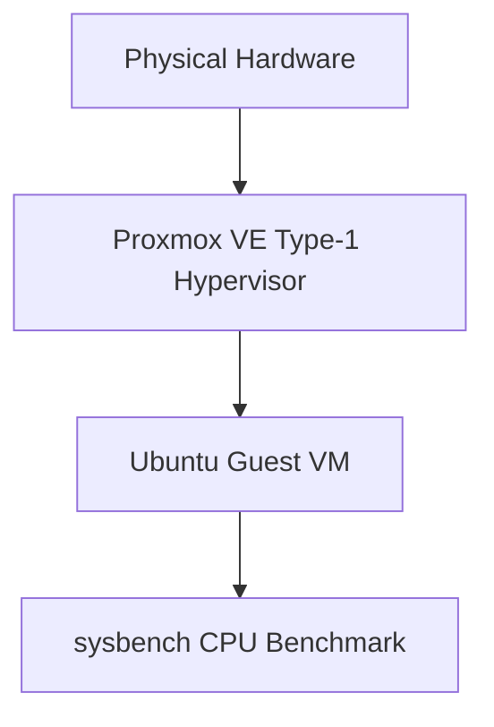

### Type-2 Hypervisor: VMware Workstation

VMware Workstation runs as an application above the host operating system. Guest instructions pass through the hosted virtualization layer and the host OS scheduler before reaching hardware resources.

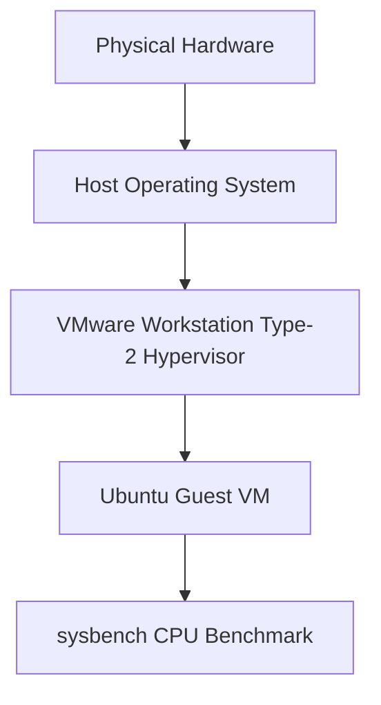

## Virtual Machine Setup

| Parameter | Part-A: Proxmox VE | Part-B: VMware Workstation |
| --- | --- | --- |
| Hypervisor type | Type-1 bare-metal | Type-2 hosted |
| Guest OS | Ubuntu | Ubuntu |
| Benchmark tool | sysbench 1.0.20 | sysbench 1.0.20 |
| CPU workload | Prime calculation up to 20,000 | Prime calculation up to 20,000 |
| Test command | `sysbench cpu --cpu-max-prime=20000 run` | `sysbench cpu --cpu-max-prime=20000 run` |
| Evidence | Part-A screenshots | Part-B screenshots |

## Benchmark Methodology

The following steps were followed for both hypervisor environments:

1. Create and boot the Ubuntu virtual machine.
2. Verify operating-system and hardware configuration.
3. Check CPU details using `lscpu`.
4. Check memory using `free -h`.
5. Check disk usage using `df -h`.
6. Monitor system activity using `top`.
7. Install and verify `sysbench`.
8. Run the CPU benchmark with a prime-number limit of `20000`.
9. Record throughput, event count, and latency values.

## Results

| Metric | Proxmox VE Type-1 | VMware Workstation Type-2 | Result |
| --- | ---: | ---: | --- |
| CPU speed | 1749.16 events/sec | 1119.03 events/sec | Proxmox is 56.31% higher |
| Total time | 10.0005 sec | 10.0006 sec | Nearly identical test window |
| Total events | 17,494 | 11,194 | Proxmox completed 6,300 more events |
| Minimum latency | 0.57 ms | 0.61 ms | Proxmox is lower |
| Average latency | 0.57 ms | 0.89 ms | Proxmox is 35.96% lower |
| 95th percentile latency | 0.58 ms | 1.50 ms | Proxmox is more consistent |
| Maximum latency | 2.43 ms | 22.38 ms | VMware showed a larger spike |

## Visual Analysis

### CPU Throughput


### Total Events Processed

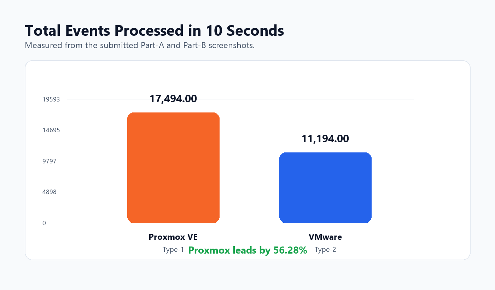

### Latency Profile


## Screenshot Evidence

### Part-A: Type-1 Proxmox VE

| Step | Screenshot |
| --- | --- |
| Proxmox dashboard |  |
| VM configuration | 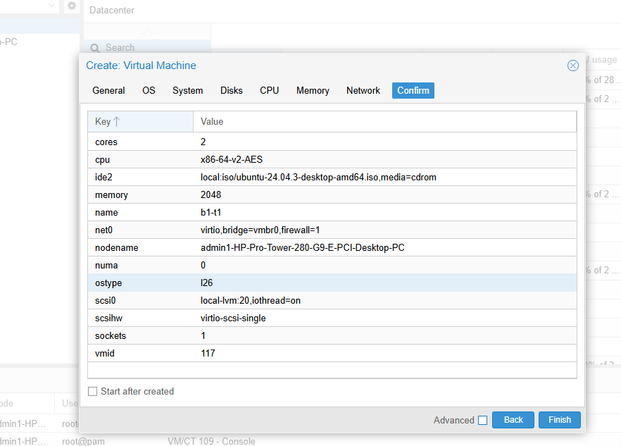 |
| VM running |  |
| Ubuntu console | 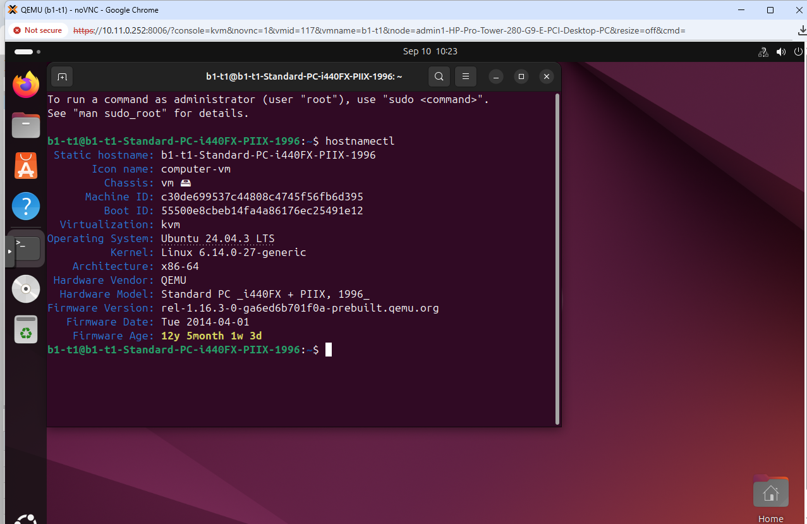 |
| System configuration |  |
| sysbench result |  |
| Resource monitoring 1 |  |
| Resource monitoring 2 |  |
| Resource monitoring 3 | 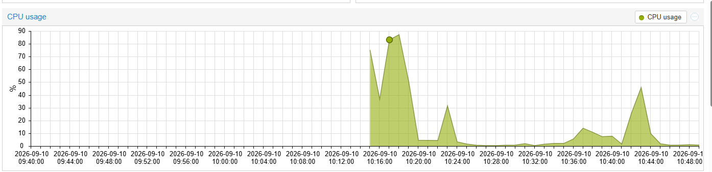 |
| Resource monitoring 4 |  |

### Part-B: Type-2 VMware Workstation

| Step | Screenshot |
| --- | --- |
| New VM wizard | 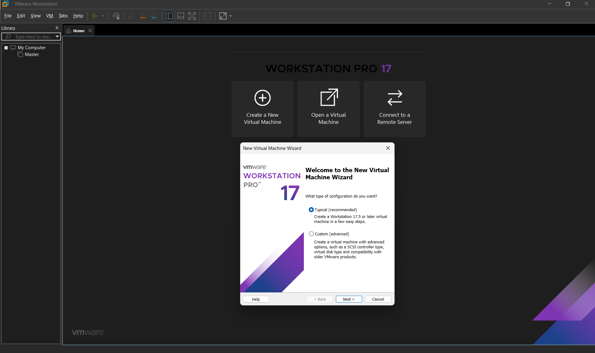 |
| 20 GB disk setup | 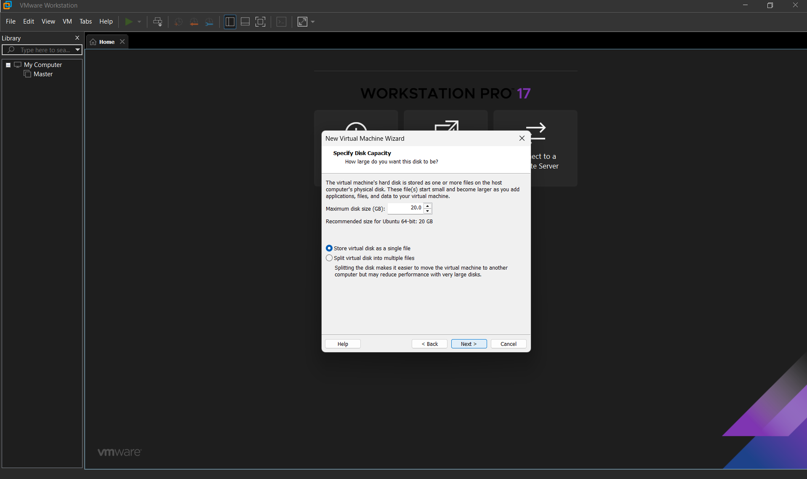 |
| RAM configuration | 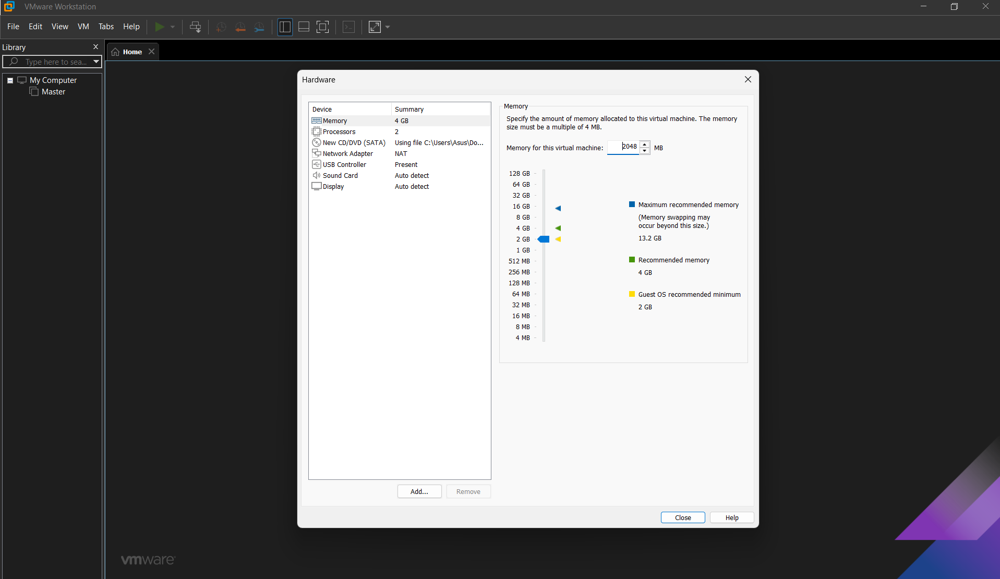 |
| CPU configuration | 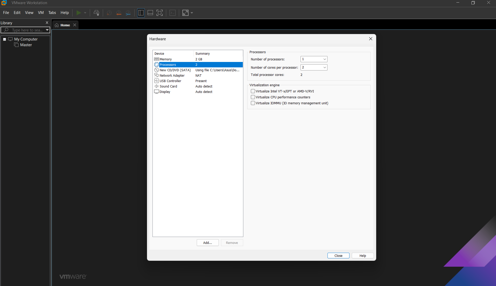 |
| Ubuntu desktop |  |
| `hostnamectl` verification | 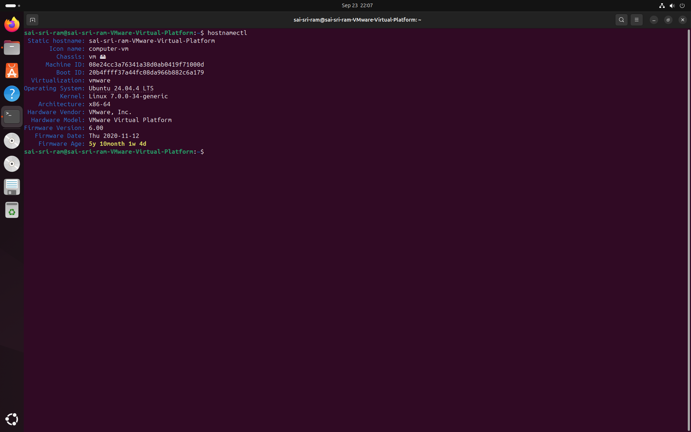 |
| `lscpu` verification | 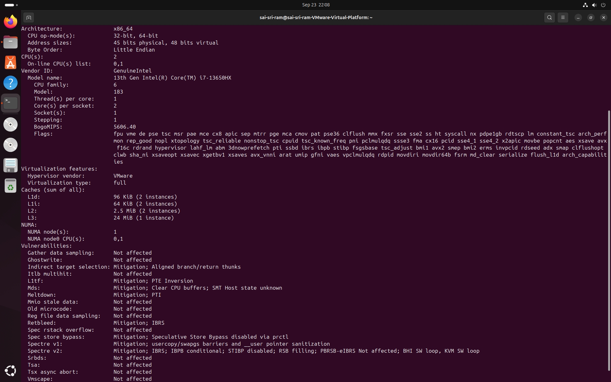 |
| `free -h` verification | 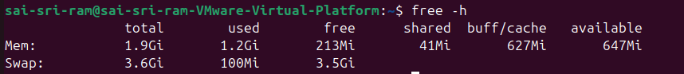 |
| `df -h` verification | 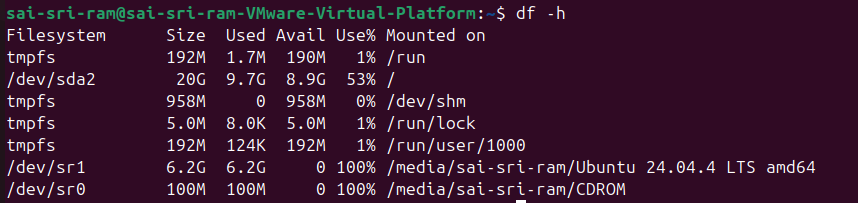 |
| `top` monitoring | 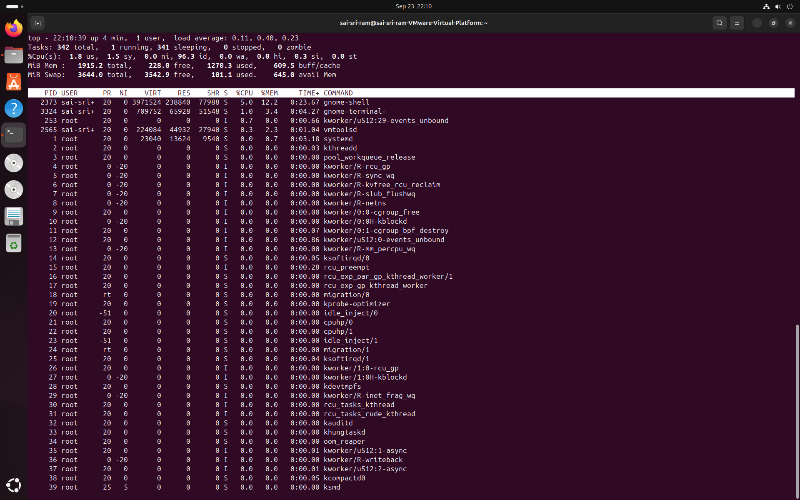 |
| sysbench installation | 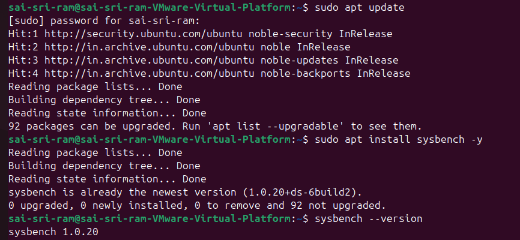 |
| sysbench benchmark |  |
| Final comparison screenshot |  |
| Hypervisor comparison visual | 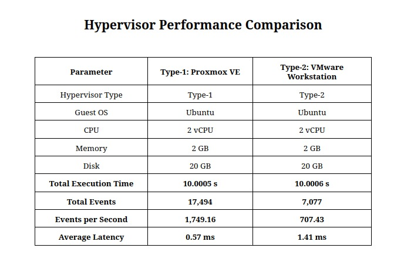 |

## Technical Discussion

The Type-1 Proxmox VE environment performed better because it runs directly above physical hardware and uses the Linux/KVM virtualization stack. This reduces the extra scheduling and abstraction overhead normally introduced by a hosted desktop hypervisor.

The Type-2 VMware Workstation environment is easier to install on a personal computer, but the guest VM shares resources with the host operating system and background services. This can increase latency variation, which is visible in the maximum latency result.

## Conclusion

The experiment demonstrates that **Type-1 hypervisors are better suited for production-like cloud workloads** where throughput, consistency, and low-latency execution matter. **Type-2 hypervisors are still useful for learning, development, testing, and local lab practice**, but they usually have more overhead because they run on top of a host operating system.

## Repository Structure

```text
Cloud-Computing-Lab/
├── README.md
├── LAB_REPORT.md
├── images/
│   ├── charts/
│   ├── part-a-proxmox/
│   └── part-b-vmware/
└── scripts/
    └── generate_charts.py
```

## How to Reproduce

Run the same benchmark command inside both Ubuntu virtual machines:

```bash
sudo apt update
sudo apt install sysbench -y
sysbench --version
sysbench cpu --cpu-max-prime=20000 run
```

To regenerate the charts after changing benchmark values, update `scripts/generate_charts.py` and run:

```bash
python scripts/generate_charts.py
```

