# 🌈 CLOUD COMPUTING LAB — EXPERIMENT 2
## 🐳 Dockerized Python Flask Application

<p align="center">
  
  
  
  
</p>

> 🧪 **Experiment 2 | Cloud Computing Laboratory**  
> 📦 Package a Python Flask web application into a Docker image, run it as a container, publish port `5000`, and verify the application through a browser.

---

## ✨ 1. Overview

This experiment packages a small **Python Flask** web application into a **Docker image** and runs it locally using **Docker Desktop on Windows**.

The application listens on port `5000`. Docker publishes the container port to the Windows host so the application can be opened from:

**🌐 `http://localhost:5000`**

> ⚠️ This is a **local Docker experiment**. It does **not** document a cloud deployment.

---

## 🎯 2. Objectives

| # | Objective |
|---:|---|
| 01 | ✅ Verify Docker installation and run the Docker `hello-world` test image |
| 02 | ✅ Create a simple Flask application and declare its dependency |
| 03 | ✅ Define the image build using a Dockerfile |
| 04 | ✅ Build the Docker image `my-python-app` |
| 05 | ✅ Run a container with host-to-container port mapping |
| 06 | ✅ Verify Docker image, container state, port mapping, and browser output |

---

## 🧰 3. Technologies Used

| Technology | Purpose |
|---|---|
| 🐍 Python | Application programming language |
| 🌐 Flask | Web framework |
| 🐳 Docker | Containerization platform |
| 🖥️ Docker Desktop | Local Docker environment on Windows |
| 💻 PowerShell | Command-line interface used during the experiment |
| 📦 `python:3.12-slim` | Base Docker image |
| 🌍 Web browser | Local application testing |

---

## 🏗️ 4. Architecture

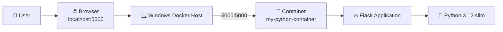

### 🔎 Request Flow

**Browser → Host Port 5000 → Docker Port Mapping → Container Port 5000 → Flask → Response**

The browser sends an HTTP request to the host's port `5000`. Docker forwards it to port `5000` inside the running container, where Flask generates the response.

---

## 📁 5. Project Structure

```text
EXPT-2 CC/
├── app.py
├── requirements.txt
├── Dockerfile
├── README.md
├── LICENSE
└── docs/
    ├── LAB_REPORT.md
    ├── screenshots/
    │   ├── 01_Docker_Version_Verification.png
    │   ├── 02_Docker_Hello_World_Test.png
    │   ├── 03_Creating_Docker_Project_Directory.png
    │   ├── 04_Flask_Application_app_py.png
    │   ├── 05_Python_Requirements_File.png
    │   ├── 06_Dockerfile_Creation.png
    │   ├── 07_Verifying_Project_Files.png
    │   ├── 08_Docker_Image_Build.png
    │   ├── 09_Docker_Image_Verification.png
    │   ├── 10_Docker_Container_Status.png
    │   ├── 11_Docker_Container_Running.png
    │   └── 12_Flask_Application_Browser_Output.png
    └── screenshots_styled/
        └── Enhanced visual copies of all 12 evidence images
```

---

## 💡 6. Application Code

### `app.py`

```python
from flask import Flask

app = Flask(__name__)


@app.route("/")
def home():
    return "Hello! My first Docker application is running."


app.run(host="0.0.0.0", port=5000)
```

### How it works

- `Flask(__name__)` creates the Flask application.
- `@app.route("/")` maps the root URL to the `home()` function.
- The function returns the application message.
- `host="0.0.0.0"` makes Flask listen on all container network interfaces.
- `port=5000` starts Flask on port `5000`.

---

## 📦 7. `requirements.txt`

```text
flask
```

This file declares the Python dependency required by the application. During image creation, Docker installs Flask using `pip`.

---

## 🐳 8. Dockerfile

```dockerfile
FROM python:3.12-slim

WORKDIR /app

COPY requirements.txt .

RUN pip install -r requirements.txt

COPY app.py .

EXPOSE 5000

CMD ["python", "app.py"]
```

### Dockerfile Instruction Guide

| Instruction | Meaning |
|---|---|
| `FROM` | Selects the base Python image |
| `WORKDIR` | Sets `/app` as the working directory |
| `COPY` | Copies local project files into the image |
| `RUN` | Executes dependency installation during image build |
| `EXPOSE` | Documents the application port |
| `CMD` | Starts the Flask application when the container runs |

---

## ▶️ 9. Commands Executed

The experiment used **PowerShell** with Docker Desktop running.

```powershell
docker --version
docker run hello-world

cd "$HOME\OneDrive\Desktop"
mkdir docker-python-app
cd docker-python-app
pwd
dir

docker build -t my-python-app .
docker images
docker run -d -p 5000:5000 --name my-python-container my-python-app
docker ps
docker ps -a
docker start my-python-container
```

### 🌐 Browser Test

Open:

```text
http://localhost:5000
```

---

## ⚠️ 10. Existing Container Name Issue

The command to create `my-python-container` encountered a **name conflict** because a container with that name already existed.

This was **not a Docker installation failure**.

The existing container was inspected and started:

```powershell
docker ps -a
docker start my-python-container
docker ps
```

The running container showed the published port mapping:

```text
0.0.0.0:5000 -> 5000/tcp
```

The Flask page was then accessed through `http://localhost:5000`.

---

## ✅ 11. Verification Checklist

| Check | Expected Result |
|---|---|
| `docker --version` | Docker installation is available |
| `docker run hello-world` | Docker test container runs successfully |
| `docker images` | `my-python-app` appears after build |
| `docker ps` | Running container appears |
| `docker ps -a` | All containers, including stopped ones, appear |
| Port mapping | `5000:5000` is published |
| Browser | Flask response is visible at `localhost:5000` |

---

## 🖼️ 12. Experiment Evidence

### Evidence 01 — Docker Version Verification
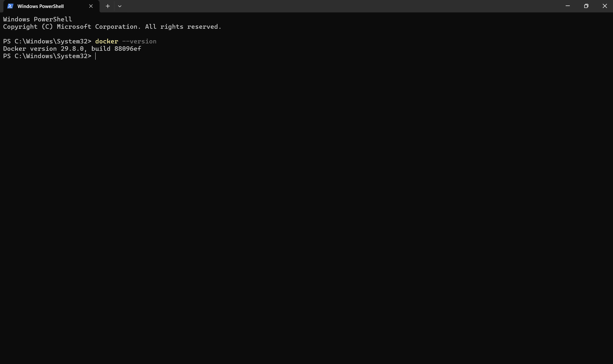

### Evidence 02 — Docker Hello World Test
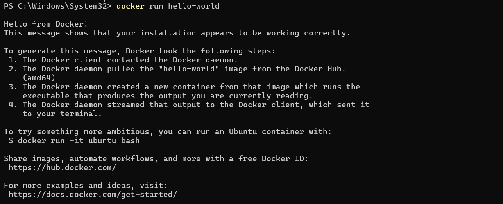

### Evidence 03 — Creating the Docker Project Directory
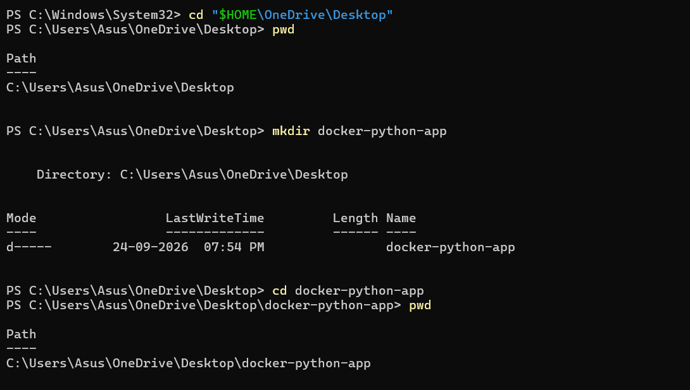

### Evidence 04 — Flask Application
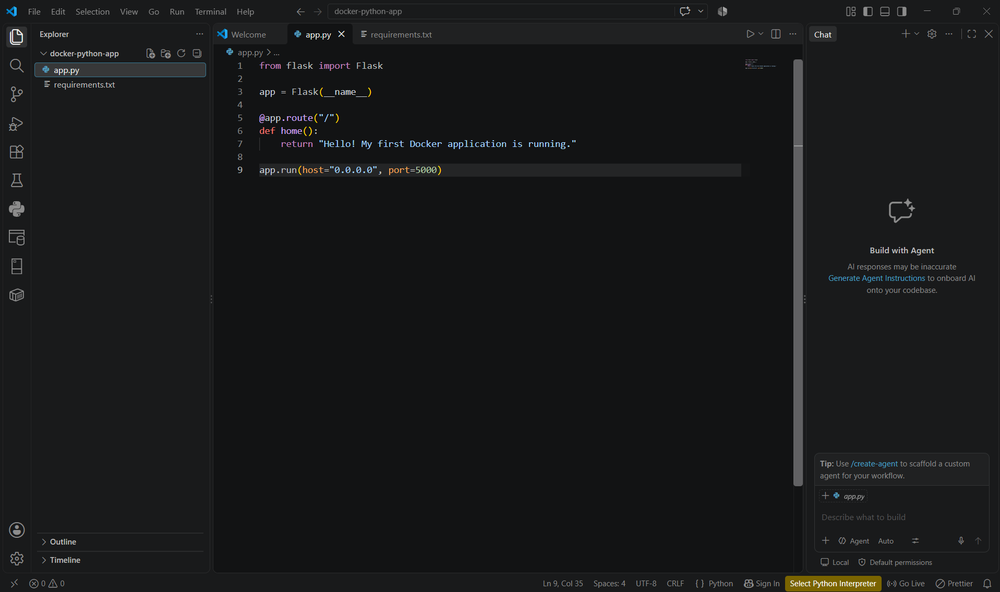

### Evidence 05 — Python Requirements File
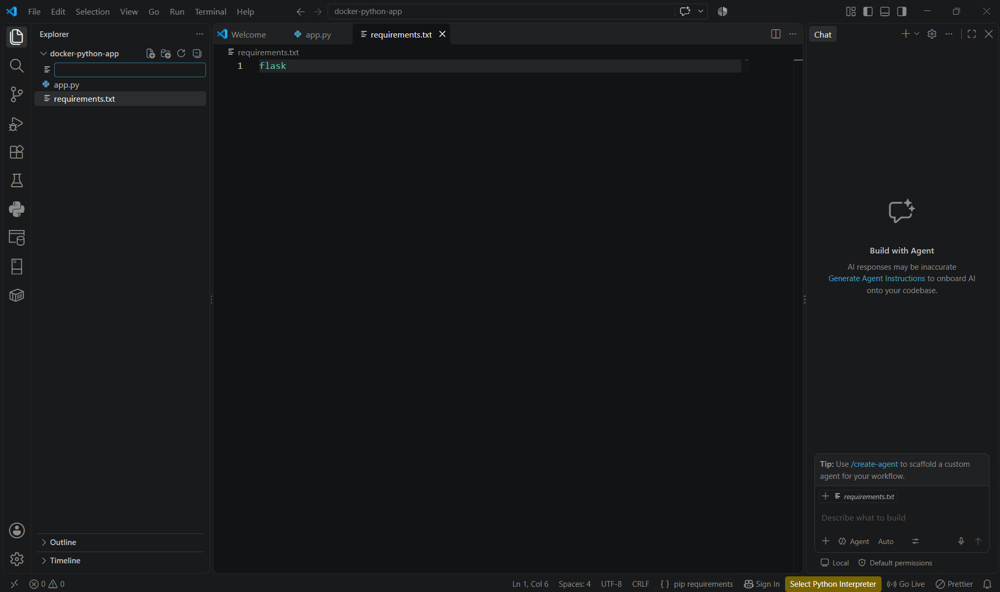

### Evidence 06 — Dockerfile Creation
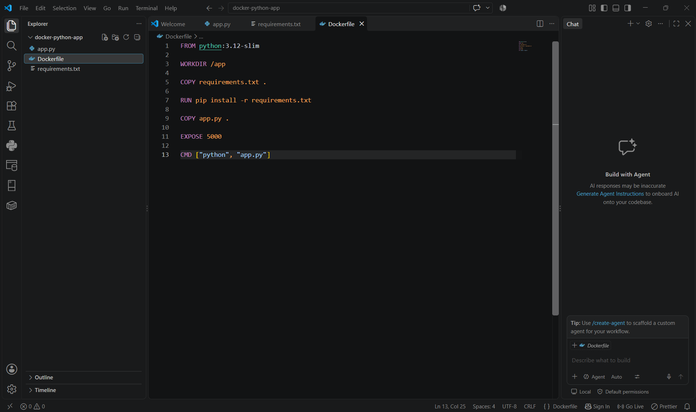

### Evidence 07 — Verifying Project Files
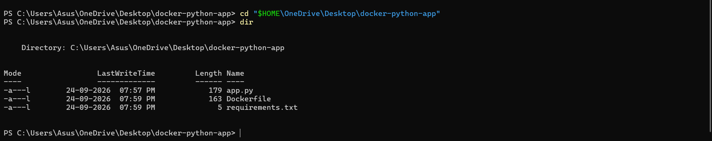

### Evidence 08 — Docker Image Build
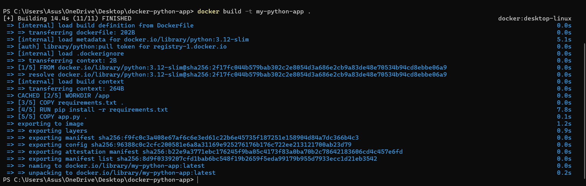

### Evidence 09 — Docker Image Verification
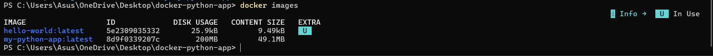

### Evidence 10 — Docker Container Status
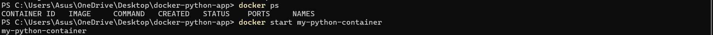

### Evidence 11 — Docker Container Running
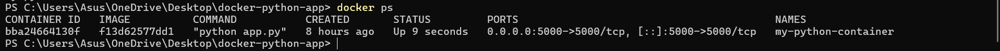

### Evidence 12 — Flask Browser Output
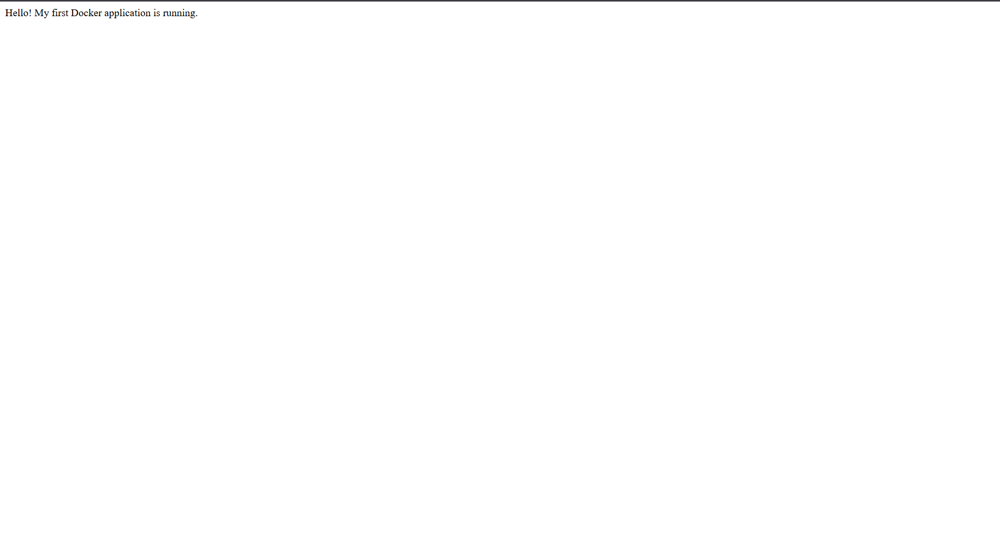

---

## 📊 13. Evidence Index

| No. | Screenshot | What it demonstrates |
|---:|---|---|
| 01 | Docker Version Verification | Confirms Docker installation |
| 02 | Docker Hello World Test | Tests Docker using `hello-world` |
| 03 | Creating Docker Project Directory | Creates the working project folder |
| 04 | Flask Application | Shows `app.py` |
| 05 | Python Requirements File | Shows the Flask dependency |
| 06 | Dockerfile Creation | Shows container configuration |
| 07 | Verifying Project Files | Confirms required project files |
| 08 | Docker Image Build | Builds `my-python-app` |
| 09 | Docker Image Verification | Displays the built Docker image |
| 10 | Docker Container Status | Checks container state |
| 11 | Docker Container Running | Shows active container and port mapping |
| 12 | Flask Application Browser Output | Verifies successful application response |

---

## 🧠 14. Key Concepts Learned

### Image vs Container

**Docker Image**
> A packaged, read-only template containing the application, dependencies, runtime, and configuration needed to create containers.

**Docker Container**
> A running instance created from a Docker image.

### Port Mapping

```text
5000:5000
```

means:

```text
Host Port 5000 → Container Port 5000
```

This is why the browser can reach Flask through:

```text
http://localhost:5000
```

### Why `0.0.0.0`?

Flask binds to:

```text
0.0.0.0:5000
```

so it listens on the container's network interfaces. Binding only to `127.0.0.1` inside the container would prevent the published Docker port from reaching the application.

---

## 🧩 15. Troubleshooting

### Issue 1 — Desktop Path

The assumed path:

```text
C:\Users\Asus\Desktop
```

was not used because the Desktop directory was under OneDrive.

The working path was reached with:

```powershell
cd "$HOME\OneDrive\Desktop"
```

### Issue 2 — Existing Container Name

`my-python-container` was already assigned to an existing container.

Resolution:

```powershell
docker ps -a
docker start my-python-container
docker ps
```

A duplicate container was not created.

---

## 📚 16. Learning Outcomes

After completing the experiment, the following were demonstrated:

- ✅ Docker image creation from a Dockerfile
- ✅ Container execution from a Docker image
- ✅ Flask application containerization
- ✅ Dependency installation inside the image
- ✅ Host-to-container port publishing
- ✅ Container lifecycle inspection
- ✅ Browser-based verification
- ✅ Basic Docker troubleshooting

---

## 🏁 17. Conclusion

The Flask application was successfully packaged into the **`my-python-app`** Docker image and run locally as **`my-python-container`**.

Port `5000` was published from the container to the host, and the expected application response was verified through the browser at:

```text
http://localhost:5000
```

---

## 🚀 18. Future Scope

The following extensions were **not performed** in this experiment but could be explored later:

- Docker Compose
- Publishing the image to Docker Hub
- CI/CD integration
- Kubernetes deployment
- Cloud deployment
- Container health checks
- Production WSGI server

---

<p align="center">

### 🐳 Containerized. 🌐 Accessible. ✅ Verified.

**Cloud Computing Lab — Experiment 2**

</p>
