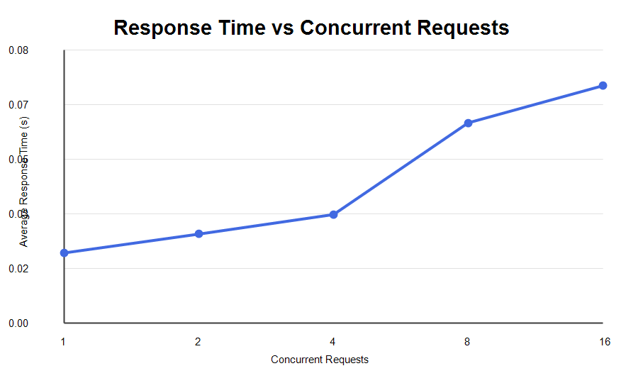
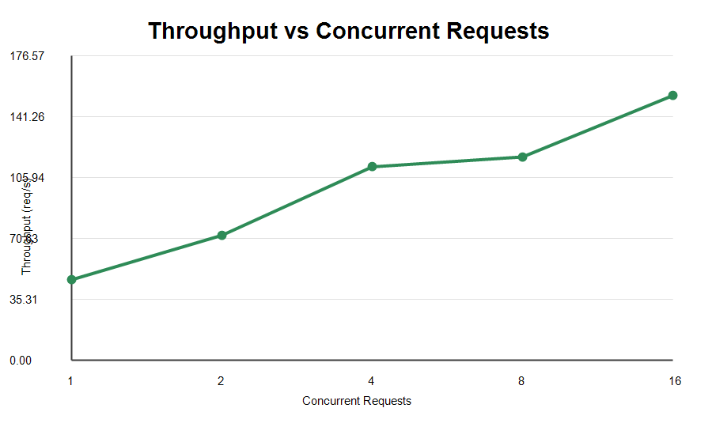

# FOOD DELIVERY - Containerized Microservice Application

## 1. Experiment Overview

This experiment builds and tests a containerized food delivery application using three independent microservices. Each service exposes REST APIs using FastAPI and runs in a separate Docker container. Docker Compose connects the services through a common network.

## 2. Aim

To design, develop, containerize, deploy, load test, monitor, and analyze a microservice application with inter-service communication.

## 3. Application Architecture

```text
                         CLIENT
                            |
                            v
                   +----------------+
                   |  ORDER SERVICE |
                   |    Port 8003   |
                   +--------+-------+
                            |
                     Docker Network
                       /          \
                      /            \
                     v              v
            +---------------+   +--------------------+
            | USER SERVICE  |   | RESTAURANT SERVICE |
            |   Port 8001   |   |     Port 8002      |
            +---------------+   +--------------------+
```

## 4. Technologies Used

- Python 3.13
- FastAPI
- Uvicorn
- Docker
- Docker Compose
- Python urllib
- Python ThreadPoolExecutor
- Docker stats
- Git and GitHub

## 5. Test Environment

- OS: Windows with PowerShell
- Docker Desktop
- Docker Compose
- Three Docker containers
- REST-based microservice architecture

## 6. Microservices

| Service | Port | Responsibility |
| --- | --- | --- |
| user-service | 8001 | Stores and returns user information |
| restaurant-service | 8002 | Stores and returns restaurant information |
| order-service | 8003 | Processes orders and communicates with user and restaurant services |

### 6.1 User Service

| Endpoint | Description |
| --- | --- |
| GET `/users/1` | Returns user information |

### 6.2 Restaurant Service

| Endpoint | Description |
| --- | --- |
| GET `/restaurants/1` | Returns restaurant information |

### 6.3 Order Service

| Endpoint | Description |
| --- | --- |
| GET `/orders/1` | Returns combined order, user, and restaurant information |

Example end-to-end response:

```json
{
  "order_id": 1,
  "user": {
    "id": 1,
    "name": "Sai Sriram",
    "location": "Hubballi"
  },
  "restaurant": {
    "id": 1,
    "name": "Sai Food Palace",
    "location": "Hubballi",
    "cuisine": "Indian"
  },
  "status": "Confirmed"
}
```

## 7. Project Structure

```text
microservice_lab/
|
|-- user-service/
|   |-- app.py
|   |-- requirements.txt
|   |-- Dockerfile
|
|-- restaurant-service/
|   |-- app.py
|   |-- requirements.txt
|   |-- Dockerfile
|
|-- order-service/
|   |-- app.py
|   |-- requirements.txt
|   |-- Dockerfile
|
|-- screenshots/
|   |-- response_time_vs_concurrency.png
|   |-- throughput_vs_concurrency.png
|
|-- docker-compose.yml
|-- load_test.py
|-- Readme.md
```

## 8. Checkpoint 1 - Design and Develop the Microservices

The selected domain is Food Delivery. Three services are implemented: User Service, Restaurant Service, and Order Service. Each service has a clear responsibility and exposes REST endpoints through FastAPI.

## 9. Checkpoint 2 - Containerize and Deploy

Each microservice contains a separate Dockerfile and requirements file. Docker Compose builds and starts all three containers.

Build and start:

```bash
docker compose up -d --build
```

Verify containers:

```bash
docker compose ps
```

## 10. Checkpoint 3 - Microservice Communication

The Order Service calls the User Service and Restaurant Service through the Docker Compose network and returns one combined response.

Main end-to-end API:

```text
http://localhost:8003/orders/1
```

## 11. Checkpoint 4 - Workload Generation and Monitoring

The `load_test.py` script sends concurrent requests to the main order API using workload levels `1, 2, 4, 8, 16`. Each workload sends 20 requests and calculates response time, throughput, successful requests, and failed requests.

Run load test:

```bash
py -3.13 load_test.py
```

Monitor Docker resources:

```bash
docker stats --no-stream
```

## 12. Results and Analysis

### 12.1 Observation Table

| Workload | Concurrency | Total Requests | Successful | Failed | Avg Response Time (s) | Total Test Time (s) | Throughput (req/s) |
| --- | ---: | ---: | ---: | ---: | ---: | ---: | ---: |
| W1 | 1 | 20 | 20 | 0 | 0.0212 | 0.4282 | 46.71 |
| W2 | 2 | 20 | 20 | 0 | 0.0269 | 0.2759 | 72.48 |
| W3 | 4 | 20 | 20 | 0 | 0.0328 | 0.1783 | 112.19 |
| W4 | 8 | 20 | 20 | 0 | 0.0605 | 0.1696 | 117.94 |
| W5 | 16 | 20 | 20 | 0 | 0.0717 | 0.1303 | 153.54 |

### 12.2 CPU Utilization

| Service | Observed CPU Utilization |
| --- | --- |
| order-service | Approximately 0.18% - 0.20% |
| user-service | Approximately 0.24% - 0.31% |
| restaurant-service | Approximately 0.21% - 0.28% |

### 12.3 Memory Utilization

| Service | Observed Memory Utilization |
| --- | --- |
| order-service | Approximately 42.6 - 42.8 MiB |
| user-service | Approximately 36.7 - 36.8 MiB |
| restaurant-service | Approximately 35.2 - 35.7 MiB |

### 12.4 Final Performance Summary

| Metric | Result |
| --- | --- |
| Total Requests Tested | 100 |
| Successful Requests | 100 |
| Failed Requests | 0 |
| Success Rate | 100% |
| Maximum Throughput | 153.54 req/s |
| Maximum Tested Concurrency | 16 |
| Minimum Response Time | 0.0212 s |
| Maximum Response Time | 0.0717 s |
| Highest Observed CPU | 0.31% |
| Highest Observed Memory | 42.8 MiB |

## 13. Performance Graphs

### Response Time vs Concurrent Requests



### Throughput vs Concurrent Requests



## 14. How to Run

```bash
git clone https://github.com/saisriram03/Cloud-Computing-Lab.git
cd Cloud-Computing-Lab/microservice_lab
docker compose up -d --build
docker compose ps
```

Test the main API:

```text
http://localhost:8003/orders/1
```

Run the load test:

```bash
py -3.13 load_test.py
```

Stop the application:

```bash
docker compose down
```

## 15. Final Deliverables Checklist

- [x] Source code of the three microservices
- [x] Three Dockerfiles
- [x] Three requirements files
- [x] docker-compose.yml
- [x] Running Docker containers
- [x] REST API endpoints
- [x] Inter-service communication
- [x] End-to-end API testing
- [x] Workload testing
- [x] Response-time measurements
- [x] Throughput measurements
- [x] Successful and failed request measurements
- [x] CPU monitoring using Docker Stats
- [x] Memory monitoring using Docker Stats
- [x] Performance observation table
- [x] Performance analysis
- [x] Conclusion
- [x] GitHub repository

## 16. Experiment Workflow

```text
DEVELOP
   |
3 Independent Microservices
   |
CONTAINERIZE
   |
Dockerfiles
   |
DEPLOY
   |
Docker Compose
   |
CONNECT
   |
Inter-Service Communication
   |
LOAD TEST
   |
1, 2, 4, 8, 16 Concurrent Requests
   |
MONITOR
   |
CPU and Memory
   |
ANALYZE
   |
Response Time and Throughput
   |
DEMONSTRATE
   |
GitHub
```

