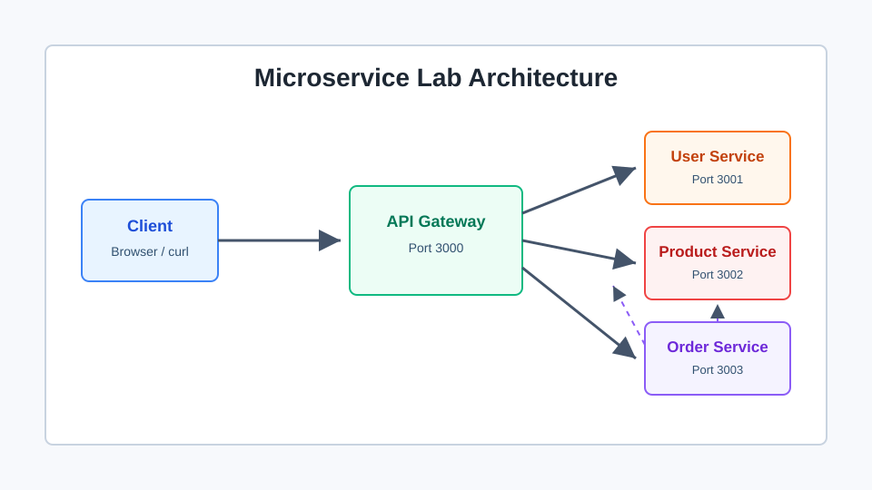

# Experiment: Building a Microservice Application

## Objective

To develop and deploy a small application using microservice architecture.

## Theory

Microservice architecture divides an application into small independent services. Each service owns one business capability and can be developed, deployed, scaled, and maintained separately. A gateway is commonly used as the public entry point so that clients do not need to directly call every internal service.

## Architecture

The application contains an API Gateway, User Service, Product Service, and Order Service. The Order Service communicates with the User Service and Product Service to prepare an order summary.

## Procedure

1. Create a separate folder for each microservice.
2. Add REST endpoints for each service.
3. Add sample JSON data for users, products, and orders.
4. Create Dockerfiles for all services.
5. Create a Docker Compose file to run the full system.
6. Add Kubernetes manifests for cloud-style deployment.
7. Test the endpoints using curl or Postman.

## Observation

The API Gateway receives requests on port 3000 and forwards them to the correct internal service. Each microservice runs independently on its own port.

## Conclusion

The experiment shows how microservices improve modularity by separating application responsibilities into smaller deployable units.

